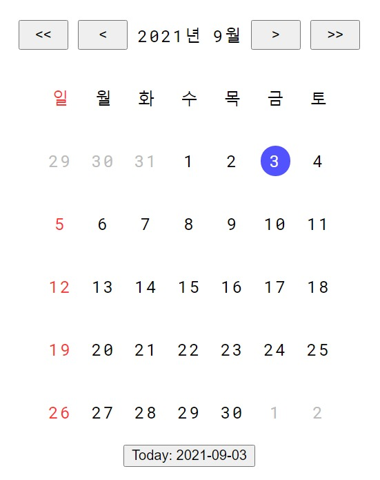

# react-calendar

[](https://www.npmjs.com/package/@bbon/react-calendar) [](https://www.npmjs.com/package/@bbon/react-calendar) [](https://github.com/bbonkr/react-calendar/actions/workflows/build-and-tag.yml) [](https://github.com/bbonkr/react-calendar/actions/workflows/publish-npm.yml)

## Peer dependencies

* react [NPM](https://www.npmjs.com/package/react) [GitHub](https://github.com/facebook/react)
* react-dom [NPM](https://www.npmjs.com/package/react-dom) [GitHub](https://github.com/facebook/react)
* dayjs [NPM](https://www.npmjs.com/package/dayjs) [GitHub](https://github.com/iamkun/dayjs)

## Installation

```bash
$ npm install --save @bbon/react-calendar
```

## Usages

```typescript

import React, {useCallback} from 'react';
import { Calendar } from '';

import '@bbon/react-calendar/dist/calendar.css';

const MyComponent = () => {

    const handleChangeSelection = useCallback(
        (start?: string, end?: string) => {
            console.info('Selected dates: ', start, end);
        },
        [],
    );

    return (
        <div>
            <Calendar
                useMoveToYear
                useMoveToMonth
                highlightToday
                showDate
                onChange={handleChangeSelection}
            />
        </div>
    );
}
```




## Example

1. Clone this repository.
2. Change directory to example

```bash
$ cd example
```

3. Install dependencies

```bash
$ npm install
```

4. Start dev server

```bash
$ npm run dev
```

5. Navigate to http://localhost:3000